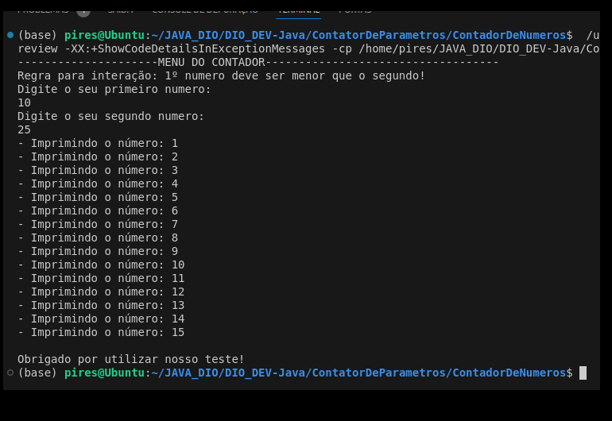

# 👋 Olá, eu sou Albino Pires!  

🌐 Cloud Enthusiast | AWS Cloud | Python | Linux  

🚀 Certificado AWS Cloud Practitioner e estudante de Computação em Nuvem, com um forte interesse em automação, infraestrutura como código (IaC),DevOps e Dev. Sempre buscando aprender mais sobre tecnologias de ponta, como Python, Terraform, Kubernetes e Docker.  

Atualmente, estou me preparando para a certificação **AWS Solutions Architect** e desenvolvendo em Java aprendendo essa linguagem fantástica para poder conseguir minha oportunidade na área Tech 🚀.  

## Este pequeno projeto foi desenvolvido conforme o programa da formação abaixo!  

## Java Developer Bootcamp - **Contador de numeros, sob uma condição específica interagindo com o usuario.**  

Aqui está um exemplo de **README.md** para documentar o projeto com o resultado esperado:

---

# Controle de Fluxo - Desafio

## 📝 **Descrição do Desafio**
Este projeto é parte do módulo **Controle de Fluxo** e foi desenvolvido para exercitar conceitos de loops, validação de entrada e tratamento de exceções em Java.

### **Cenário Proposto**
1. O sistema recebe **dois parâmetros via terminal** representando dois números inteiros.
2. A partir desses números:
   - Calcula a quantidade de interações necessárias (`for`) e imprime os números incrementados no console no formato:
     ```
     Imprimindo o número 1
     Imprimindo o número 2
     ...
     ```
3. Caso o **primeiro número seja maior ou igual ao segundo**, lança uma exceção customizada chamada **ParametrosInvalidosException** com a mensagem:
   ```
   O segundo parâmetro deve ser maior que o primeiro
   ```

---

## 🚀 **Estrutura do Projeto**
O projeto é composto pelas seguintes classes:

1. **`Contador`**
   - Responsável por capturar os números via terminal e realizar a contagem.
2. **`ParametrosInvalidosException`**
   - Representa uma exceção customizada de validação para garantir que o primeiro número seja menor que o segundo.

---

## 📂 **Como Executar**
1. Clone este repositório:
   ```bash
   git clone https://github.com/seu-usuario/DesafioControleFluxo.git
   cd DesafioControleFluxo
   ```
2. Compile o projeto:
   ```bash
   javac Contador.java
   ```
3. Execute o programa:
   ```bash
   java Contador
   ```

---

## 💻 **Funcionamento**
### Exemplo 1: Entrada Válida
**Entrada:**
```
Primeiro número: 12
Segundo número: 30
```

**Saída:**
```
Imprimindo o número 1
Imprimindo o número 2
Imprimindo o número 3
...
Imprimindo o número 18
```

### Exemplo 2: Entrada Inválida
**Entrada:**
```
Primeiro número: 30
Segundo número: 12
```

**Saída:**
```
O segundo parâmetro deve ser maior que o primeiro
```

---

## 🖼️ **Print do Resultado**
### Exemplo de Execução (Entrada Válida):



---

## 🛠️ **Tecnologias Utilizadas**
- **Java**: Linguagem de programação principal.
- **Terminal**: Entrada e saída de dados via console.

---

## ✨ **Objetivos de Aprendizado**
- Praticar controle de fluxo com loops (`for`).
- Validar entradas do usuário.
- Criar e lançar exceções customizadas em Java.
- Exibir mensagens formatadas no console.

---
### 🚀 **Certificados**  
Certificados emitidos para cada módulo concluído estão aqui:

- [](https://www.linkedin.com/in/albino-pires-b188391b3/)


---
🚀*🚀*🚀*🚀*🚀*🚀*🚀*🚀*🚀*🚀*🚀*🚀*🚀*🚀*🚀*🚀*🚀*🚀*🚀*🚀*🚀*🚀*🚀*🚀*🚀*🚀*🚀*🚀*🚀*🚀*