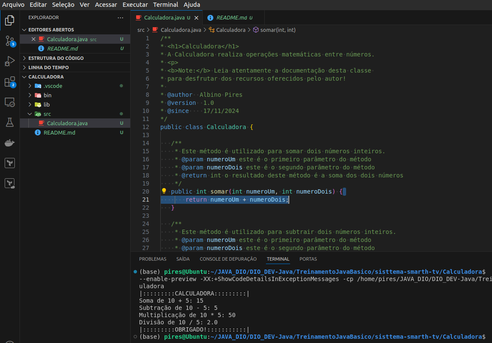

### README.md

```markdown
# Calculadora Java

**Calculadora** é uma aplicação simples desenvolvida em **Java** para realizar operações matemáticas básicas entre dois números inteiros. Este projeto foi criado com fins educativos, demonstrando o uso de classes, métodos e operações básicas em Java.

---

## 💻 Funcionalidades

- Soma de dois números inteiros.
- Subtração de dois números inteiros.
- Multiplicação de dois números inteiros.
- Divisão de dois números inteiros.

---

## 🛠️ Como funciona

O programa cria uma instância da classe `Calculadora` e executa as operações diretamente com números predefinidos. O resultado de cada operação é exibido no terminal, com o seguinte formato:

```java
System.out.println("|:::::::::CALCULADORA:::::::::|");

System.out.println("Soma de 10 + 5: " + calculadora.somar(10, 5));
System.out.println("Subtração de 10 - 5: " + calculadora.subtrair(10, 5));
System.out.println("Multiplicação de 10 * 5: " + calculadora.multiplicar(10, 5));
System.out.println("Divisão de 10 / 5: " + calculadora.dividir(10, 5));

System.out.println("|:::::::::OBRIGADO!:::::::::::|");
```

---

## 📋 Exemplo de saída

A execução do programa retorna a seguinte saída no terminal, criei a ilustração para fácil compreensão:

```
|:::::::::CALCULADORA:::::::::|
Soma de 10 + 5: 15
Subtração de 10 - 5: 5
Multiplicação de 10 * 5: 50
Divisão de 10 / 5: 2
|:::::::::OBRIGADO!:::::::::::|
```

---

## 🖼️ Imagem do funcionamento



---

## 🔧 Tecnologias utilizadas

- **Java SE**: Linguagem principal do projeto.
- **IntelliJ IDEA** ou **VSCode com extensão Java**: IDEs recomendadas para executar e editar o código.

---

## 🚀 Como rodar o projeto

1. **Clone este repositório**:
   ```bash
   git clone https://github.com/seu-usuario/calculadora-java.git
   ```

2. **Compile o código**:
   ```bash
   javac Calculadora.java
   ```

3. **Execute o programa**:
   ```bash
   java Calculadora
   ```

---

## 🤝 Contribuições

Fique à vontade para contribuir com melhorias, novas funcionalidades ou relatar problemas. Abra uma **issue** ou envie um **pull request**.

---

## 🧑‍💻 Autor

Desenvolvido por **Albino Pires**.

---
