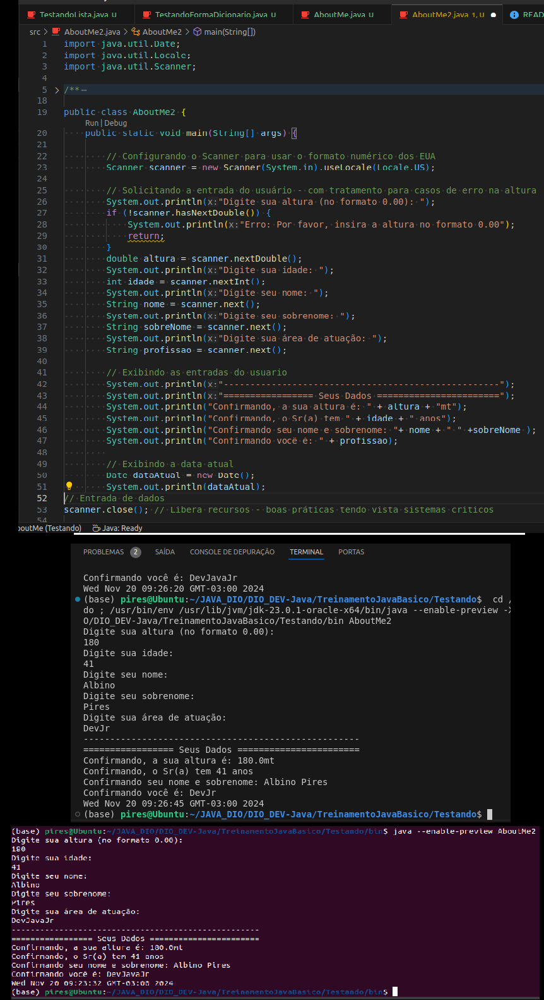

### README.md

```markdown
# 📘 Aprendizado em Java - Iteração de Hoje

Este repositório contém os exemplos e exercícios desenvolvidos durante a prática de programação em Java no dia **20/11/2024**. O foco foi explorar conceitos importantes da linguagem, como manipulação de entrada de dados, scanner, classes, métodos, e boas práticas para testes no terminal e IDEs.

---

## 📝 Tópicos Abordados

1. **Manipulação de Entrada de Dados com `Scanner`**
   - Configuração de entrada utilizando `Scanner` para leitura de valores do tipo `int`, `double`, e `String`.
   - Uso de `Locale.US` para assegurar leitura de números no formato americano (ponto decimal).

   ```java
   Scanner scanner = new Scanner(System.in).useLocale(Locale.US);
   double altura = scanner.nextDouble();
   ```

2. **Boas Práticas com `Scanner`**
   - Importância do fechamento do recurso `Scanner` utilizando `.close()` para liberar recursos.

3. **Execução de Classes via Terminal**
   - Como compilar e executar classes no terminal utilizando argumentos:
     ```bash
     java AboutMe Albino Pires 30 1.75 Desenvolvedor
     ```
   - Validação do número de argumentos passados ao programa para evitar erros de execução.

4. **Testes com Argumentos no `launch.json`**
   - Configuração de argumentos diretamente no arquivo `launch.json` para facilitar testes em IDEs como VSCode.

5. **Tratamento de Exceções**
   - Abordagem inicial para tratamento de entradas inválidas usando `try-catch` (para entradas incorretas do usuário).

6. **Exemplo de Classe com Interação no Terminal**
   - Criamos a classe `AboutMe2` com um exemplo interativo, onde o programa solicita dados do usuário e retorna um resumo das informações:

   ```java
   public class AboutMe2 {
       public static void main(String[] args) {
           Scanner scanner = new Scanner(System.in).useLocale(Locale.US);
           System.out.println("Digite seu nome: ");
           String nome = scanner.next();
           System.out.println("Digite sua idade: ");
           int idade = scanner.nextInt();
           System.out.println("Bem-vindo, " + nome + ". Sua idade é: " + idade);
           scanner.close();
       }
   }
   ```

7. **Uso de Métodos e Classes**
   - Implementamos métodos que formatam e validam dados de entrada, como um método para formatar um CEP.

---

## 📂 Estrutura do Repositório

```
/src
├── AboutMe.java          # Classe que demonstra uso de argumentos em args[]
├── AboutMe2.java         # Classe interativa utilizando Scanner
├── PontoEletronico.java  # Exemplo de classe com boas práticas de nomeação
```

---

## 🔗 Links Relacionados

- [Documentação Oficial do Java](https://docs.oracle.com/javase/8/docs/)
- [Guia para Configuração do `launch.json` no VSCode](https://code.visualstudio.com/docs/editor/debugging)
- [Documentação do Scanner](https://docs.oracle.com/javase/8/docs/api/java/util/Scanner.html)

---

## 💡 Observações

- Certifique-se de que o JDK está instalado corretamente para executar os exemplos.
- Os códigos foram escritos utilizando o **Java SE 23**, portanto, para executar corretamente, utilize o comando:
  ```bash
  java --enable-preview NomeDaClasse
  ```
---

## 📷 Demonstração

### Exemplo de Execução:



---

**Autor:** Albino Pires  
**Data:** 20/11/2024  
**Versão:** 1.0
```

Você pode ajustar conforme achar necessário, incluindo mais informações sobre o contexto dos exemplos ou expandindo a seção de links.